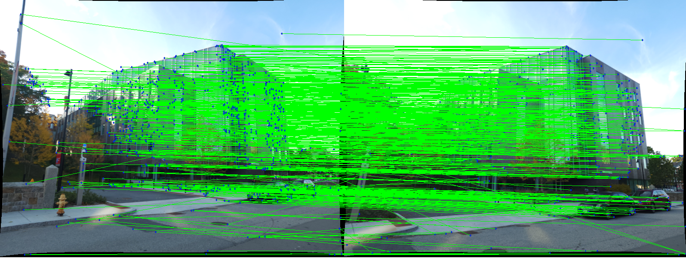
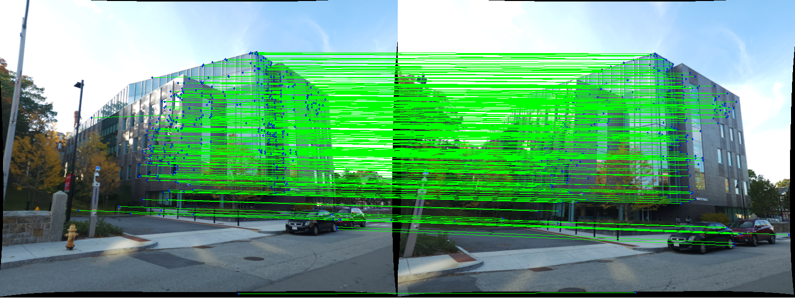

# Classical-SfM
Implementation of Classical Structure from Motion pipeline


## How to run the code
```
python3 Wrapper.py
```

## Project Guidelines:
RBE549 Computer Vision, Spring 2023, [Project 3 Description](https://rbe549.github.io/spring2023/proj/p2/)

## Outputs

### Initial Feature Matches


### Inlier Features (after RANSAC)
